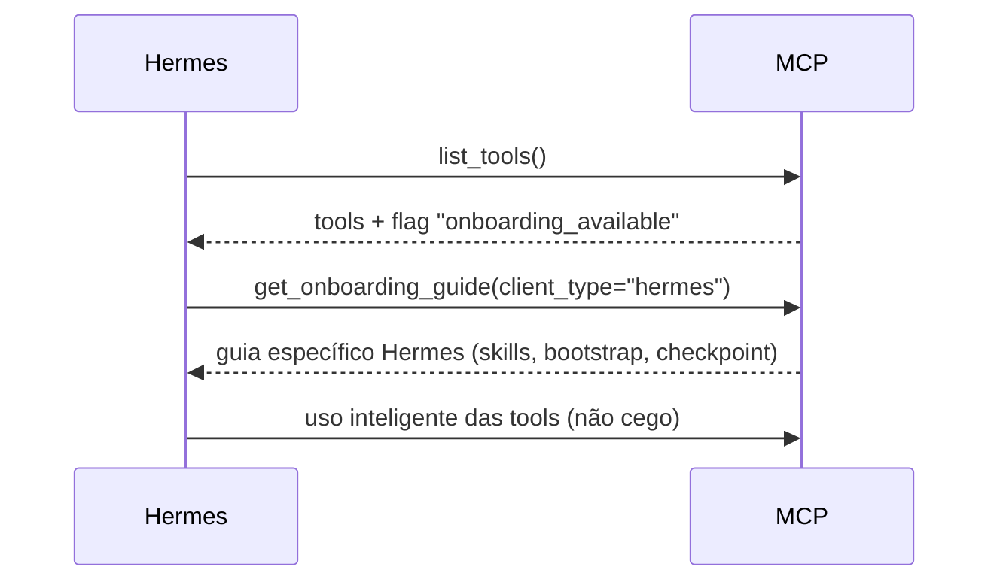
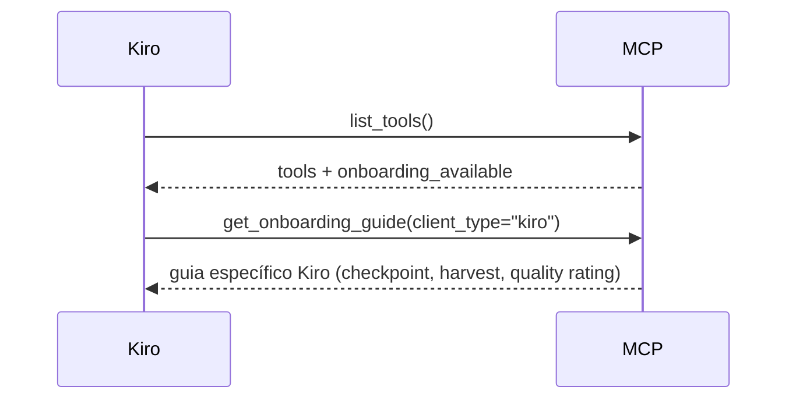
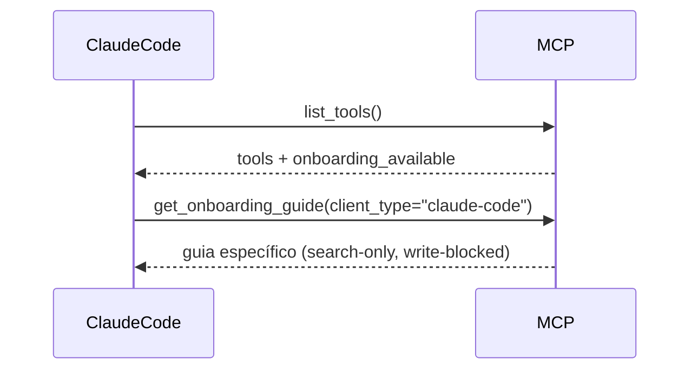

# RFC: Onboarding Discovery Protocol — Agent-Native MCP Usage Guides

**Status:** Rascunho para discussão (T'Pol + Kiro + Claudio)
**Date:** 2026-07-07
**Author:** T'Pol (a partir de diálogo com Claudio)
**Target:** mcp-memory-service (upstream) + Hermes Agent

---

## 1. Problema

MCP servers expõem tools e resources via `list_tools` e `list_resources`, mas **não há mecanismo padrão para o servidor comunicar ao agente como ser usado corretamente**.

Consequências:

- Cada agente (Hermes, Kiro, Claude Code) descobre MCPs de forma diferente
- O `get_onboarding_guide` existe mas é só mais uma tool — o agente precisa **saber que ela existe** para chamá-la
- Não há onboarding contextual: Hermes, Kiro e Claude Code têm modelos de ferramentas e permissões diferentes, mas recebem o mesmo guia genérico
- Agentes novos (ex: OpenCode, Cline) precisam reaprender o protocolo do zero
- O conhecimento de *como usar* o sistema fica em docs externos (README, wiki, skills), não acessível via MCP

## 2. Casos de Uso

### 2.1. Hermes Agent conecta no mcp-memory-service



### 2.2. Kiro CLI conecta no mesmo servidor



### 2.3. Claude Code conecta (via remote MCP)



## 3. Proposta

### 3.1. Server-Side: Sinalização de Onboarding

No handshake MCP (ou no `list_tools`), o servidor sinaliza que tem onboarding disponível.

**Opção A — Resource URI (recomendada):**
```
mcp协议://mcp-memory/onboarding/{client_type}
```
Resource standards do MCP. O agente faz `read_resource("mcp://mcp-memory/onboarding/hermes")`.

**Opção B — Tool com hinted discovery:**
A tool `get_onboarding_guide` ganha um description que inclui `[ONBOARDING]` — o agente parseia descriptions em `list_tools` para descobrir.

**Opção C — Novo campo no list_tools response (requer spec MCP):**
Cada tool pode ter um campo opcional `onboarding_key` que referencia recursos de onboarding. Futuro, não implementável hoje.

### 3.2. Server-Side: Guias Multi-Cliente

`get_onboarding_guide` aceita `client_type` e retorna conteúdo adaptado:

| client_type | Conteúdo | Tom |
|-------------|----------|-----|
| `generic` (default) | Checklist básico: bootstrap → work → commit | Neutro |
| `hermes` | Skills Hermes + terminal + cron + delegate | Integração com skills |
| `kiro` | CLI flags, checkpoint, quality rating, env vars | Focado em CLI |
| `claude-code` | Apenas search tools, write restrictions, MCP config | Restritivo |
| `opencode` | Plugin hooks, slash commands | Plugin-oriented |

Formato: YAML frontmatter + markdown, parseável.

```yaml
---
mcp_version: ">=10.73.0"
client_type: hermes
requires:
  tools: [memory_store, memory_search, memory_quality, memory_consolidate]
  bootstrap: true
  checkpoint: true
max_concurrent_tools: 3
---
## Onboarding Guide for Hermes Agent
...
```

### 3.3. Client-Side: Descoberta Automática

Cada agente cliente (Hermes, Kiro, Claude Code) deve:

1. Ao conectar num MCP server, verificar se onboarding está disponível
2. Se sim, chamar `get_onboarding_guide(client_type=<self>)` automaticamente
3. Injetar o guia no contexto do agente (como persona / steering)
4. Usar o guia para:
   - Saber quais tools priorizar
   - Entender limitações (ex: "não pode write")
   - Conhecer o ciclo de vida esperado (bootstrap → work → commit)

**Para Hermes:** implementar como skill automática que carrega ao detectar MCP server com onboarding. A skill `mcp-memory-onboarding` pode ser gerada a partir do guia.

**Para Kiro:** hook no `kiro-cli-chat` que chama onboarding ao resolver `mcp:` no prompt.

**Para Claude Code:** PR no repositório `mcp-memory-service` que adiciona o guia como resource.

### 3.4. Formato do Guia (Estruturado)

```yaml
---
mcp_version: ">=10.73.0"
client_type: hermes
agent_model: deepseek-v4-flash
requires:
  bootstrap: true
  checkpoint: true
  tools_required: [memory_store, memory_search, memory_quality]
  tools_optional: [memory_consolidate, memory_explore, memory_detail]
limits:
  max_concurrent_tools: 3
  max_store_size: 50000
workflow:
  on_start: [get_bootstrap_profile, mistake_note_search]
  on_topic_end: [memory_quality rate, memory_store]
  on_session_end: [commit_session_legacy, memory_quality rate ≥3]
conceptual:
  memory_types:
    decision: "escolhas arquiteturais, por que algo foi feito"
    observation: "fatos observados, dados brutos"
    learning: "insights destilados de experiência"
    reference: "documentação, specs, guias"
    note: "notas temporárias, rascunhos"
  ranking:
    mode_ranked: "recência + frequência de acesso + qualidade"
    mode_hybrid: "similaridade semântica + quality boost"
    mode_semantic: "similaridade pura de embeddings"
---
## Onboarding para Hermes Agent
...
```

## 4. Impacto

### No mcp-memory-service (upstream)
- Pequeno: estender `get_onboarding_guide` com client_types
- Médio: adicionar resource URI `/onboarding/{type}` (se optar pela Opção A)
- Documentação: guias por cliente em `docs/onboarding/`

### No Hermes Agent
- Médio: hook pós-conexão MCP que detecta onboarding e carrega skill
- Skills: skill gerada automaticamente a partir do guia

### No Kiro CLI
- Pequeno: `kiro-cli-chat` chamar `get_onboarding_guide` ao conectar em MCP
- Steering: injetar guia no contexto do agente

### No Claude Code
- Pequeno: config `claude.json` com `onboarding_guide` resource

## 5. Alternativas Consideradas

### 5.1. README only (como hoje)
**Rejeitado.** Não escala para múltiplos agentes. Cada agente precisa descobrir programaticamente.

### 5.2. skills hermes avulsas (como hoje)
**Parcial.** Skills resolvem para Hermes mas não para Kiro/Claude Code. Cada agente reinventa.

### 5.3. MCP spec extension (campo `onboarding` em list_tools)
**Futuro.** Ideal mas requer mudança na spec MCP. Viável como RFC para o MCP specification.

### 5.4. .mcp-onboarding.yaml no repo do servidor
**Interessante.** Arquivo YAML no root do repositório MCP server que declara:
```yaml
onboarding:
  resource: "mcp://memory/onboarding/{client}"
  clients: [hermes, kiro, claude-code, opencode, cline, continue-dev]
```
Agentes poderiam descobrir SEM chamar tool — apenas lendo metadata do repositório. Porém, não funciona para servidores remotos sem repositório público.

## 6. Próximos Passos (se aprovado)

1. ✅ **Rascunho para discussão** (este documento)
2. **Revisão com Kiro** — alinhar viabilidade no Hermes
3. **Issue no upstream** (#122 ou similar) — apresentar para Henry
4. **Implementação server-side** — estender `get_onboarding_guide`
5. **Implementação Hermes** — hook de auto-discovery
6. **Implementação Kiro** — onboarding no connect
7. **Documentação** — guias por cliente

## 7. Referências

- `get_onboarding_guide` tool (mcp-memory-service v10.73+)
- `harvest-hermes-sessions` skill (Hermes Agent)
- `workflow-memoria-checkpoint` skill (Hermes Agent)
- Skill `upstream-fork-management` — pair review workflow
- Perfil do Henry/doobidoo: `pesquisa/perfil-doobidoo.md`
